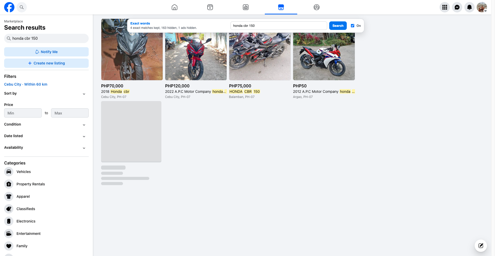

# FB Custom Strict Search

A Chrome extension (Manifest V3) that tightens Facebook Marketplace search.

Facebook still runs the search. This extension then keeps a listing only when **every word you typed** appears in that item's title or description, in any order. Matching words are highlighted. Ads and "results from outside your search" are hidden. Remaining tiles pack into a normal grid with no empty holes.

Search on Marketplace as usual. The floating panel is a tiny dashboard for that search. It only appears when the page URL contains marketplace. It does not have its own search box.

Search `honda cbr 150` and a Honda CBR without `150`, a CBR 150 without Honda, or a CBR 250 will drop out. With substring on, `ninja 250` also keeps `ninja z250sl`. A size like `48gb` also matches `48 GB`. Prices like `PHP250,000` do not count as a `250` match.



## Features

- **All-word match**: every token must appear in the title, the description, or split across both
- **Order does not matter**: `cbr honda 150` matches the same listings as `honda cbr 150`
- **Substring or exact**: substring is on by default, so `ninja 250` keeps `ninja z250sl`. Switch to Exact for whole-word only
- **Prices ignored**: `PHP250,000` does not satisfy a `250` token
- **Memory sizes**: `48gb` matches `48GB` and `48 GB`, but not a 48-core GPU with 16GB RAM
- **Highlights** matching words on kept cards
- **Hides ads** and the outside-your-search block
- **Packs the grid** so leftover results look like a normal feed
- **Tiny dashboard**: a compact panel shows the search, how many listings stay visible, how many were hidden, and how many ads were dropped
- **Draggable panel**: it starts under the Marketplace search box at the same width, like an autocomplete. Drag it and it flings to the left or right

## Install (unpacked)

1. Clone this repo and install dependencies:

```bash
git clone https://github.com/torrefrancae/fb-custom-strict-search-chrome-extension.git
cd fb-custom-strict-search-chrome-extension
npm install
npm run build
```

2. Open `chrome://extensions` in Chrome.
3. Turn on **Developer mode**.
4. Click **Load unpacked** and select the `dist` folder (not the repo root).
5. Open [Facebook Marketplace](https://www.facebook.com/marketplace/) and search as usual.

Reload the extension on `chrome://extensions` after each `npm run build`.

## How it works

1. You search in Facebook Marketplace. The extension does not replace that search box.
2. A page-world script reads listing payloads from Marketplace network responses.
3. An isolated content script scores each result card: every query word must appear in the title or description.
4. Substring mode allows a word to sit inside a longer token (`250` inside `z250sl`). Exact mode requires whole words.
5. Non-matching tiles, ads, and the outside-search block are hidden at the grid-cell level so the row closes up.
6. Kept cards get yellow highlights on the matched words.
7. The floating panel sits under the Marketplace search box and shows match counts. Drag it to move it.

The extension does not call a private API of its own. It only filters the Marketplace page you already opened.

## Project layout

```text
src/
  background.ts          Service worker: injects on Marketplace navigations
  content/               Overlay, drag snap, card detection, ads, highlights
  shared/                Tokenizer, match rules, listing extraction
  popup/                 Toolbar popup
scripts/build.ts         Bundles TypeScript into dist/
tests/match.test.ts      Unit tests for the matcher
tests/listing.test.ts    Unit tests for payload parsing
tests/float.test.ts      Unit tests for panel edge snap
tests/puppeteer/         Optional live Chrome tests
```

## Scripts

| Command | What it does |
| --- | --- |
| `npm run build` | Bundle the extension into `dist/` |
| `npm test` | Run matcher, listing, and snap unit tests |
| `npm run test:browser` | Puppeteer fixture plus a fresh-profile Marketplace check |
| `npm run test:browser -- --screenshots --html-report` | Same, with a local HTML report |

Live session tests attach to a Chrome instance you start yourself. They are optional and are not required to build or load the extension.

```bash
./scripts/launch-session.sh
npm run test:session -- --query="honda cbr 150" --screenshots --html-report
```

## Tests

```bash
npm test
```

The matcher tests cover:

- words in any order
- words split across title and description
- title-only and description-only hits
- a missing word (listing is dropped)
- substring hits such as `ninja 250` inside `ninja z250sl`
- exact mode so `civic` does not match `civics`
- prices so `PHP250,000` is not treated as a `250` model match

## Privacy

- Runs locally in your browser
- Stores on/off, substring vs exact, and panel position in `chrome.storage.local`
- Does not send listing data to a third-party server

## License

MIT
